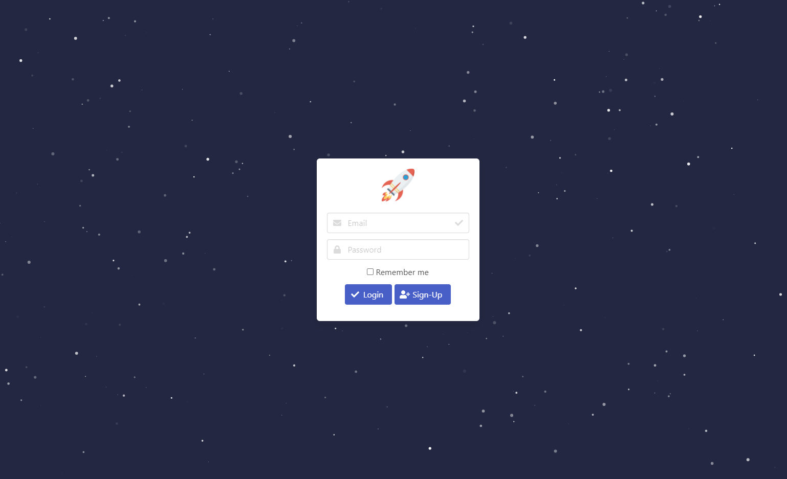

# Bulma Login/Sign-Up Page
A repository that contains a login page, created with Bulma and Particles.js. This project was created in order to provide a quick intro into Bulma as a CSS Framework. Particles.js was used to populate the background.

## Desktop Screenshot

  

## Mobile Screenshot

   

